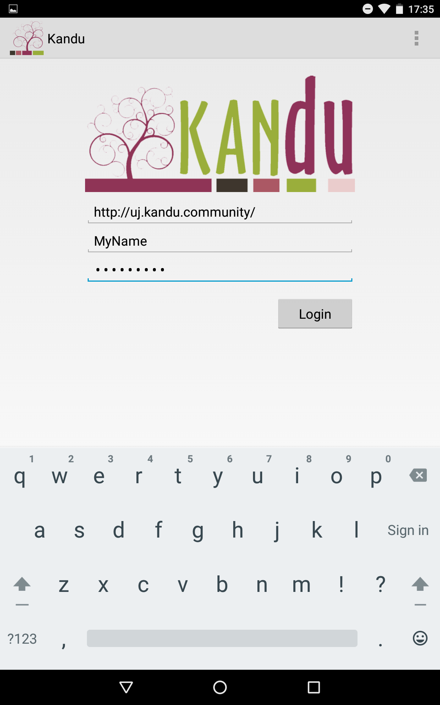

# YAI Kandu Manual

## Table of contents

1. Logging In
2. Registering a Member
3. Registering a Garden

## 1. Logging In

### 1.1 Find open applications listing from home screen

### 1.2 Open the Kandu application

### 1.3 Ensure that the 'Server URL' field is set to 'http://uj.kandu/community'

### 1.4 Enter your username and password

### 1.5 Click the login button to send the details

### 1.6 The maps view should now display

## 2. Registering a Member

## 3. Registering a Garden
