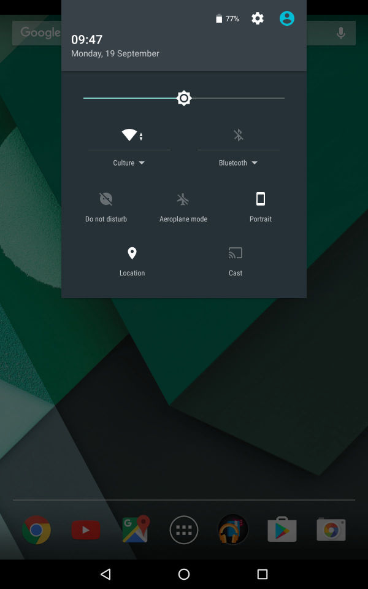

# YAI Kandu Manual

## Table of contents

1. Installation
2. Logging In
3. Registering a Member
4. Registering a Garden

## 1. Installation

### 1.1 From the home screen swipe down to display the notifications drawer

### 1.2 Tap the top (grey area) of the notifications drawer to expand it

### 1.3 Tap the cog icon to open the device's settings menu

### 1.4 Tap the security item to open the security settings

### 1.5 Tap the switch next to the 'Unkown Sources' item to allow the installation of application from sources other than the Play Store

### 1.6 The switch should turn blue indicating that the 'Unkown Sources' option has been enabled

### 1.7 Go back to the home screen and open the applications listing by tapping the icon of six blocks contained in a circle

### 1.8 Find the *Chrome* application in the list and open it by tapping it's icon

### 1.9 Click [this link](/apks/kandu_2.0.17.apk) to download the application

### 1.10 Tap the application file attachment at the bottom of the email to begin downloading the application file and wait for the download to finish

### 1.11 Wait for the application file to finish downloading

### 1.12 Once the download has finished continue with the installation by tapping 'INSTALL'

### 1.13 Wait for the application installation to finish

### 1.14 A message should then display indicating that the application has successfully been installed

## 2. Logging In

### 2.1 Find and open applications listing from home screen

### 2.2 Open the Kandu application

### 2.3 Ensure that the 'Server URL' field is set to 'http://uj.kandu/community'

### 2.4 Enter your username and password

### 2.5 Click the login button to send the details

### 2.6 The maps view should now display

## 3. Registering a Member

## 4. Registering a Garden
