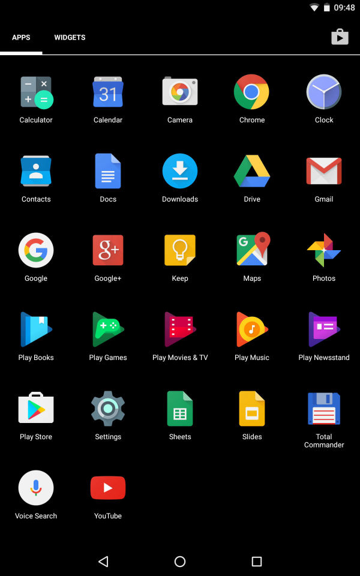
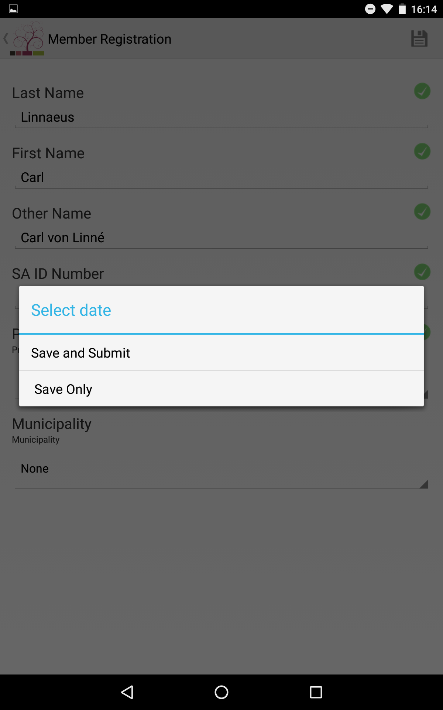
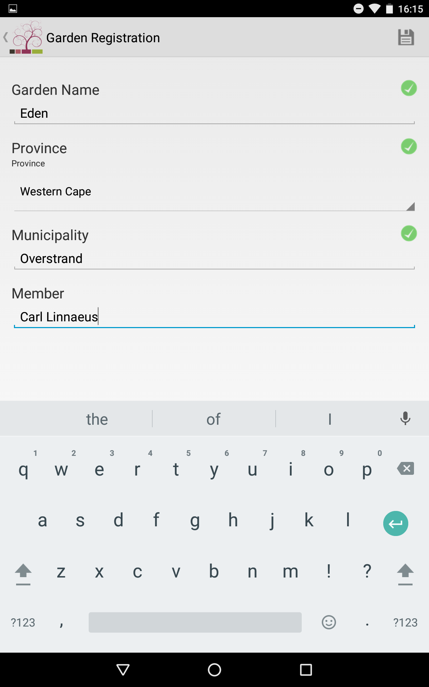

# YAI Kandu Manual

## Table of contents

1. Installation
2. Logging In
3. Registering a Member
4. Registering a Garden

## 1. Installation

### 1.1 From the home screen swipe down to display the notifications drawer

### 1.2 Tap the top (grey area) of the notifications drawer to expand it

### 1.3 Tap the cog icon to open the device's settings menu

### 1.4 Tap the security item to open the security settings

### 1.5 Tap the switch next to the 'Unkown Sources' item to allow the installation of application from sources other than the Play Store

### 1.6 The switch should turn blue indicating that the 'Unkown Sources' option has been enabled

### 1.7 Go back to the home screen and open the applications listing by tapping the icon of six blocks contained in a circle

### 1.8 Find the Gmail application in the list and open it by tapping it's icon

### 1.9 Find the email containing the application and open it by tapping it

### 1.10 Tap the application file attachment at the bottom of the email to begin downloading the application file and wait for the download to finish

### 1.11 Wait for the application file to finish downloading

### 1.12 Once the download has finished continue with the installation by tapping 'INSTALL'

### 1.13 Wait for the application installation to finish

### 1.14 A message should then display indicating that the application has successfully been installed

## 2. Logging In

### 2.1 Find and open applications listing from home screen

### 2.2 Open the Kandu application

### 2.3 Ensure that the 'Server URL' field is set to 'http://uj.kandu/community'

### 2.4 Enter your username and password

### 2.5 Click the login button to send the details

### 2.6 The maps view should now display

## 3. Registering a Member

### 3.1 Start from map view(2.6.) and tap menu-icon at top-left of screen

### 3.2 Select *"Member Registration* from dropdown menu

### 3.3 Select *"+Member Registration* with the big plus sign from the *"Member Registration* sub-menu

### 3.4 Fill in the member details

### 3.5 If you have connectivity tap *"Save and submit* else tap *"Save only*

### 3.6 Member has been added

## 4. Registering a Garden

### 4.1 Start from map view( 2.6 ) and tap menu-icon top left of screen

### 4.2 Select *Garden Registration* from the dropdown menu

### 4.3 Select *+Garden Registration* with the big plus sign from the *Garden Registration* sub-menu

### 4.3 Fill in the Garden details

### 4.4 If you have connectivity tap *Save and submit* else tap *Save only*,this stores the member registration locally on your device( see 2.7 on how to submit locally stored member registration forms to Kandu database )

### 4.5 If you see *server error* check connectivity,if no connection is available tap *save only*

### 4.6 Garden has been added

### 4.7 Submit a locally stored member registration form to Kandu database

#### 4.7.1 Start from map view( 2.6 ) and tap menu-icon top right of screen

#### 4.7.2 Tap *Saved forms*

#### 4.7.3 Tap *Submit all*

#### 4.7.3 If no saved forms remains all forms have been submitted,else try again when you have connectivity

