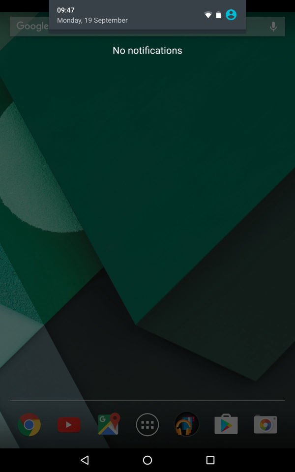
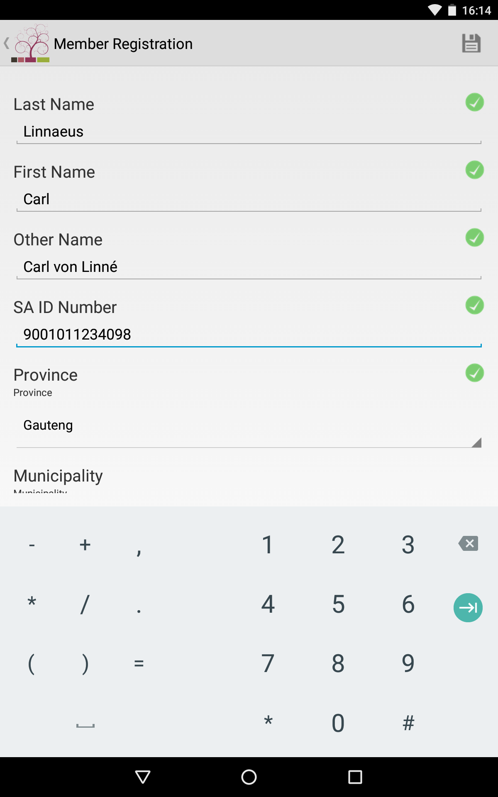
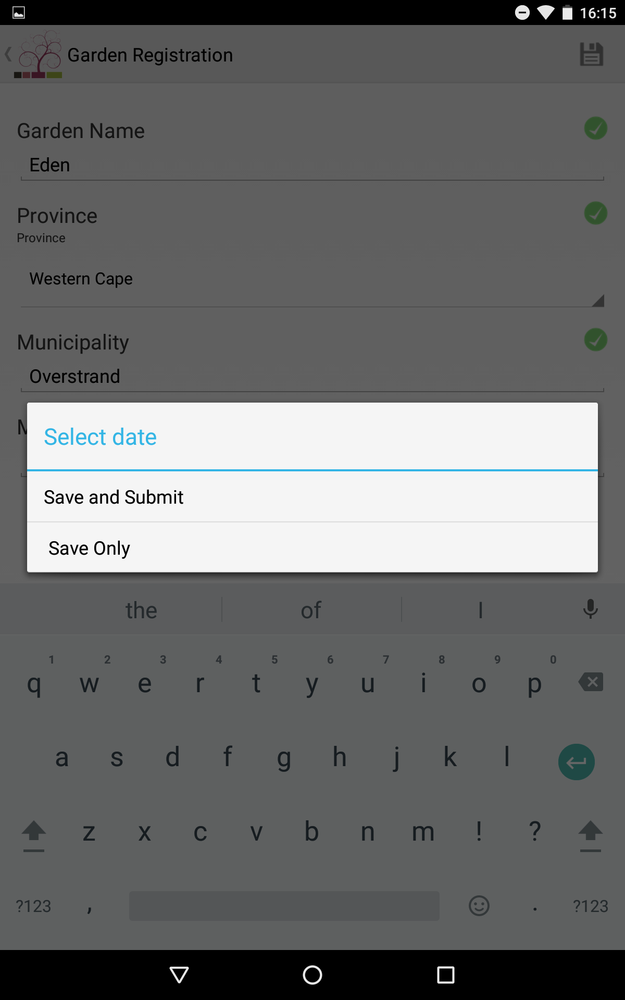

# YAI Kandu Manual

## Table of contents

1. [Installation](#1-installation)
2. [Logging In](#2-logging-in)
3. [Using the menu to Navigate form data entry](#3-using-the-menu-to-navigate-form-data-entry)
4. [How to submit locally saved form data to the remote database](#4-how-to-submit-locally-saved-form-data-to-the-remote-database)
5. [Different type of data fields and their usage](#5-different-type-of-data-fields-and-their-usage)

## 1. Installation

### 1.1 From the home screen swipe down to display the notifications drawer

### 1.2 Swipe down the top (grey area) of the notifications drawer to expand it

### 1.3 Tap the cog icon to open the device's settings menu

### 1.4 Tap the security item to open the security settings

### 1.5 Tap the switch next to the 'Unkown Sources' item to allow the installation of application from sources other than the Play Store

### 1.6 The switch should turn blue indicating that the 'Unkown Sources' option has been enabled

### 1.7 Go back to the home screen and open the applications listing by tapping the icon of six blocks contained in a circle

### 1.8 Find the *Chrome* application in the list and open it by tapping it's icon

### 1.9 Click [this link](/apks/kandu_2.0.17.apk) to download the application

### 1.10 Tap the application file attachment at the bottom of the email to begin downloading the application file and wait for the download to finish

### 1.11 Wait for the application file to finish downloading

### 1.12 Once the download has finished continue with the installation by tapping 'INSTALL'

### 1.13 Wait for the application installation to finish

### 1.14 A message should then display indicating that the application has successfully been installed

## 2. Logging In

### 2.1 Find and open applications listing from home screen

### 2.2 Open the Kandu application

### 2.3 Ensure that the 'Server URL' field is set to 'http://uj.kandu/community'

### 2.4 Enter your username and password

### 2.5 Click the login button to send the details

### 2.6 The maps view should now display

## 3. Using the menu to Navigate form data entry

### 3.1 Start from map view (seen in 2.6) and tap menu-icon top left of screen

### 3.2 Select applicable category of data forms eg. *Garden Registration* from the dropdown menu

### 3.3 Select specific form with the big plus sign eg. *Garden Registration* from the main category sub-menu

### 3.4 Fill in the Form fields (see section 4 for different field usage)

### 3.5 If you have connectivity tap *Save and submit*, this submits the form data to the Kandu remote database. If you have no connectivity tap *save only*, this stores data locally on your device. The locally stored form data can then be submitted when you have a wifi/mobile connection again (see section 4 on "How to submit locally saved data to the remote Kandu database")

### 3.6 If you see *submitted* the form data has been submitted to remote database

### 3.7 If you see *saved successfully* the form data was saved locally on your device (see [section 4](#4-how-to-submit-locally-saved-form-data-to-the-remote-database))

### 3.8 If you see *server error*, repeat [section 3](#3-using-the-menu-to-navigate-form-data-entry) - The form data has not been submitted nor saved

## 4. How to submit locally saved form data to the remote database

### 4.1 Start from map view (seen in 2.6) and tap the more icon at top-right of the screen

### 4.2 Select *Saved forms*

### 4.3 Select *Submit all* all to submit all of the locally saved forms

### 4.4 If no saved forms are visible then all forms have been submitted

## 5. Different type of data fields and their usage

### 5.1 Text field

### 5.2 AutoLookUp - Text field

### 5.3 Dropdown select single option menu

### 5.4 Dropdown checkbox menu

### 5.5 Add photo

## 6. How to clear the application cache

### 6.1 Start from home screen and swipe down from top of the screen to display the notification drawer

### 6.2 Swipe down once more to expand this drawer and tap the settings-icon (gear)

### 6.3 In the *Settings* menu under the sub-menu *Device* tap *Apps*

### 6.4 Scroll to Kandu and tap the app list item

### 6.5 Tap the *Storage* section in the list

### 6.6 Tap the *CLEAR CACHE* button

